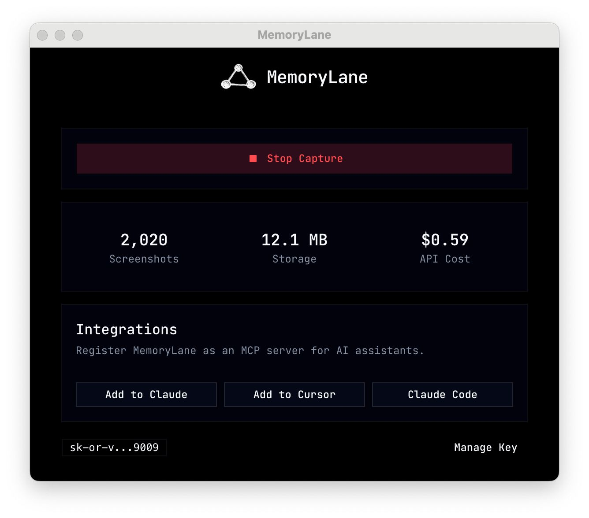
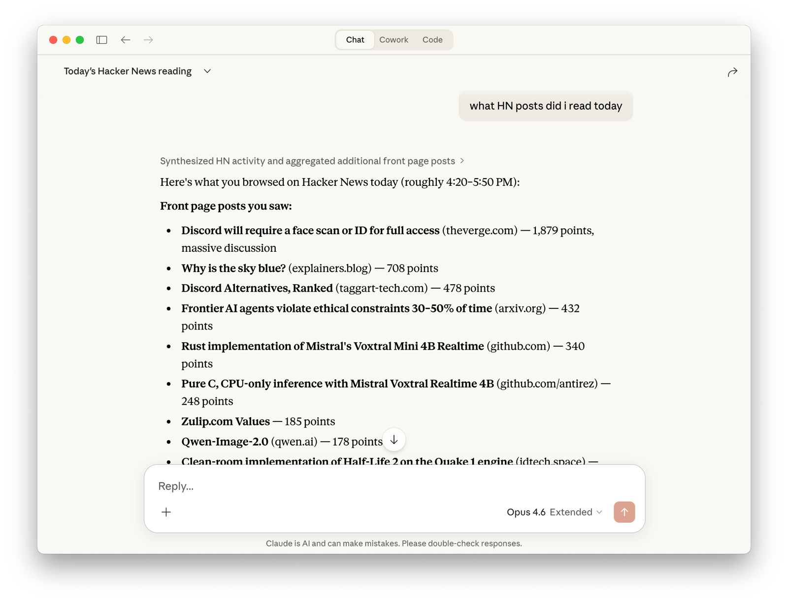
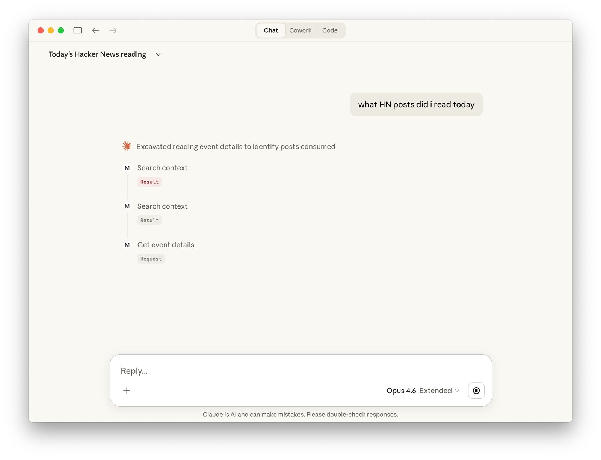

# MemoryLane

[](https://discord.gg/AHmURhKXdP)

## Installation

### macOS (Apple Silicon)

```bash
curl -fsSL https://raw.githubusercontent.com/deusXmachina-dev/memorylane/main/install.sh | sh
```

This downloads the latest release and installs it to `/Applications`.

### Windows

1. Download `MemoryLane-Setup.exe` from the latest [GitHub Releases](https://github.com/deusXmachina-dev/memorylane/releases) entry.
2. Run the installer and finish setup.
3. Launch MemoryLane from the Start menu.

## TL;DR

Desktop app that sees what you see, builds context about how you work, and surfaces automation opportunities — all queryable from any AI chat via MCP.

**Screenshots → context → task recommendations → MCP into AI chats**

🎬 [Demo](https://www.youtube.com/watch?v=MU7S3FHHlr8)

<p align="center">
  
  
  
</p>

### Example queries

Once connected, try asking your AI assistant things like:

- "What was I working on this morning?"
- "Pick up where I left off on the auth refactor"
- "Summarize my research on **[topic]** from last week"
- "What tasks can I automate based on my workflow?"
- "Show me patterns you've noticed in how I work"

## Privacy & Permissions

MemoryLane captures your screen to give AI assistants context about what you're working on. Here's what that means in plain terms:

- **Screen Recording** — the app takes screenshots of your display. macOS will ask you to grant Screen Recording permission. This means the app can see everything on your screen while capture is running.
- **Accessibility** — the app monitors keyboard and mouse activity (clicks, typing sessions, scrolling) to decide _when_ to capture. macOS will ask you to grant Accessibility permission. The app does not log keystrokes.
- **What happens to screenshots** — screenshots are sent to your configured model endpoint for summarization (OpenRouter by default, or a custom endpoint such as local Ollama). The screenshots are then deleted.
- **What is stored** — only short text summaries, OCR extracts, and vector embeddings are kept in a local SQLite database on your machine. Nothing leaves your device except the screenshot sent for processing.
- **Endpoint credentials** — by default, the app uses [OpenRouter](https://openrouter.ai/) and needs API credentials. You have two built-in options:
  - **Power User ($30/month)** _(recommended)_ — includes automation recommendations, no API keys needed. We provision an OpenRouter API key tied to your device — MemoryLane does **not** proxy your requests. Your screenshots go directly from your machine to OpenRouter.
  - **Bring Your Own Key** — already have an OpenRouter account? Paste your own API key instead. You pay OpenRouter directly and have full control over your account, usage limits, and billing.
  - You can also configure a custom OpenAI-compatible endpoint (for example a local Ollama server), including its own auth header if needed.
  - Any saved secret is encrypted and stored locally using Electron's safeStorage.

> **Bottom line:** you are giving this app permission to see your screen and detect your input. All captured data is processed into text and stored locally. Screenshots are sent directly from your machine to the configured model endpoint (OpenRouter by default, or your custom provider). MemoryLane never proxies your capture payloads.

## Current Status

> **⚠️ Early release**
>
> This is a fully functional early release. Expect rough edges.

### What works today

- Regular screenshots while capture is running; two processing modes: **video** (stitches frames into a clip for multimodal LLM) and **image-only** (samples key frames), with auto-fallback
- Summaries generated per activity (on app switch, idle gap, or max duration)
- OCR via macOS Vision framework and native Windows OCR
- AI-powered activity summarization across managed, OpenRouter, and custom OpenAI-compatible endpoints (including local models like Ollama)
- **Auto-generated user context** — weekly LLM-built profile of who you are and how you work, injected into summarization and pattern detection for personalized output
- **Task recommendations** — daily background scan finds recurring automatable workflows from your context; pattern cards with thumbs up/down feedback and "Copy prompt for Claude" action
- **Privacy controls** — exclude apps, window titles, and URLs by substring; automatic private/incognito browsing suppression; tray icon reflects privacy state
- LLM health monitoring with connection testing and status indicators
- Semantic (vector) + full-text search over your activity history
- MCP server with 7 tools: `search_context`, `browse_timeline`, `get_activity_details`, `get_user_context`, `list_patterns`, `search_patterns`, `get_pattern_details`
- One-click integration with Claude Desktop, Claude Code, and Cursor
- Periodic raw database export to a user-selected folder
- Configurable capture settings, model selection per task, and API usage tracking
- Launch at login, auto-update

## Usage

### Requirements

- macOS (Apple Silicon / ARM64) or Windows (x64)
- A configured model endpoint:
  - Power User plan ($30/month), **or**
  - your own [OpenRouter](https://openrouter.ai/) API key, **or**
  - a custom OpenAI-compatible endpoint (for example local Ollama)

### First launch

1. Grant **Screen Recording** permission when prompted
2. Grant **Accessibility** permission when prompted
3. Choose your default model provider:
   - **Power User** _(recommended)_ — click Get API Key to subscribe ($30/month via Stripe)
   - **Bring Your Own Key** — paste your OpenRouter API key if you already have one
4. Optional: configure a custom endpoint/model in settings if you want to use local or self-hosted models

### Start capturing

Click the MemoryLane icon in your menu bar and select **Start Capture**. The app will begin taking regular screenshots while capture is running. Summaries are generated on activity boundaries (app switches, idle gaps, or max duration). You can stop anytime from the same menu.

### Connect to an AI assistant

From the tray menu, click **Add to Claude Desktop**, **Add to Claude Code**, or **Add to Cursor**. This registers MemoryLane as an MCP server so your AI assistant can query your activity history. The MCP server also works standalone without the desktop app via `npm run mcp:start`.

You can also set it up manually by pointing your MCP client to the MemoryLane server binary.

**Available MCP tools:**

| Tool                   | Purpose                                                 |
| ---------------------- | ------------------------------------------------------- |
| `search_context`       | Semantic + full-text search over activity summaries     |
| `browse_timeline`      | List activities in a time range with sampling           |
| `get_activity_details` | Full details including OCR text for specific activities |
| `get_user_context`     | Auto-generated user profile                             |
| `list_patterns`        | All detected workflow patterns                          |
| `search_patterns`      | Keyword search over patterns                            |
| `get_pattern_details`  | Full pattern detail with sightings                      |

All time parameters accept ISO 8601 or natural language (e.g., `"1 hour ago"`, `"yesterday"`).

When using MCP tools:

- Use event **summaries** to answer "what was I doing?" questions.
- Use **OCR text** only for exact recall (specific strings, file names, errors, or quotes).
- Avoid drawing activity conclusions from OCR alone, because OCR may include unrelated on-screen text.

### Slack integration

To set up the Slack reply flow, follow [docs/slack-app-setup.md](docs/slack-app-setup.md). A ready-to-paste Slack manifest lives in [docs/slack-app-manifest.template.json](docs/slack-app-manifest.template.json).

## How It Works

AI conversations are full of friction because LLMs have no context about you. MemoryLane fixes that by watching what you do and making it searchable.

1. **Capture** — the app collects user interaction events (clicks, typing, scrolling, app switches) and takes regular screenshots while capture is running.
2. **Summarize** — screenshots are fed to an LLM in one of two modes: **video** (stitched into a clip for a multimodal model) or **image-only** (sampled key frames). Summaries are generated per activity — on app switch, idle gap, or max duration. OCR is performed locally via platform-native APIs.
3. **Store** — screenshots are deleted after processing. Only text summaries, OCR extracts, and vector embeddings are stored locally in SQLite.
4. **Build context** — a weekly background job generates a profile of who you are and how you work, used to personalize all downstream outputs.
5. **Recommend tasks** — a daily background scan identifies recurring automatable workflows from your context; you can approve, dismiss, or copy them as prompts for Claude.
6. **Expose** — an MCP server gives AI assistants on-demand access to your activity history, user context, and detected patterns.

### Why cloud by default?

**Performance** — local models are ~4 GB and turn laptops into space heaters. We believe most users prefer speed and normal battery life from an invisible background app.

**Quality** — cloud models perform significantly better for summarization and OCR. Local models make a nice demo but fall short when users expect reliable output.

If you prefer local or self-hosted inference, you can now configure custom OpenAI-compatible endpoints (for example Ollama). Cloud remains the default path for most users because it is faster and typically more accurate.

## CLI

A standalone CLI lets AI agents (Claude Code, Cursor, etc.) query your MemoryLane database without the Electron app running.

```bash
npm install -g @deusxmachina-dev/memorylane-cli
memorylane set-db ~/Library/Application\ Support/MemoryLane/memorylane.db
```

Commands:

```bash
memorylane stats                          # Database statistics
memorylane search "auth refactor"         # Full-text search
memorylane search "auth" --mode vector    # Semantic search (requires @huggingface/transformers)
memorylane timeline --limit 10            # Recent activities
memorylane timeline --app Chrome          # Filter by app
memorylane activity <id>                  # Activity details
memorylane patterns                       # Detected patterns
memorylane pattern <id>                   # Pattern details
```

The DB path is resolved in order: `--db-path` flag > `MEMORYLANE_DB_PATH` env var > saved config (`set-db`) > platform default.

## Build from Source

1. Clone this repo
2. `npm install`
3. `npm run dev` to start in development mode
4. See [docs/CONTRIBUTING.md](docs/CONTRIBUTING.md) for setup, testing, and manual validation guidance
5. See [CLAUDE.md](CLAUDE.md) for full development commands and architecture details

## Limitations

1. **Windows OCR depends on native OCR availability** — if OCR language components are unavailable on a given Windows setup, OCR can fail while capture continues.
2. **Platform support is still evolving** — Linux and Intel macOS are not yet officially supported. Linux builds are generated but not included in the release pipeline.

## Coming Soon

- **Browser integration** — deeper context from browser tabs and web apps
- **Managed cloud service** — hosted version with richer integrations, online LLM tool access, and zero setup
- **Cross-platform parity** — Intel Mac and Linux support

## Community

Questions, feedback, and feature ideas are welcome in our Discord server.

[Join the MemoryLane Discord](https://discord.gg/AHmURhKXdP)

## Star History

[](https://www.star-history.com/#deusXmachina-dev/memorylane&type=date&legend=top-left)
