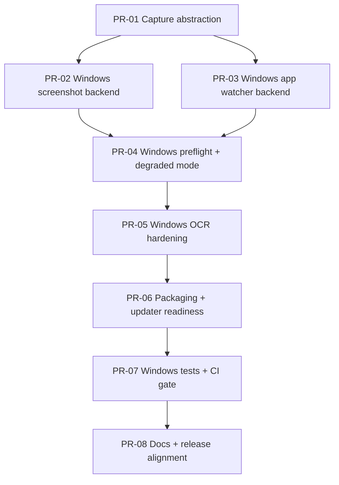

# Windows Re-Enable PR Plan

Difficulty scale: `S` (small), `M` (medium), `L` (large)

## PR Breakdown

1. **PR-01: Capture backend abstraction**
   - Add platform backend interface + selector for v2 screenshot capture.
   - Difficulty: `M`

2. **PR-02: Windows screenshot backend**
   - Implement `win32` screenshot backend that returns the same capture contract as macOS.
   - Difficulty: `L`

3. **PR-03: Windows app/window watcher**
   - Add `win32` app-watcher backend and wire it through `app-watcher.ts`.
   - Difficulty: `L`

4. **PR-04: Windows preflight + degraded mode**
   - Extend startup checks for Windows dependencies and surface clear degraded-mode warnings.
   - Difficulty: `M`

5. **PR-05: Windows OCR hardening**
   - Improve OCR readiness checks, timeouts, and actionable error diagnostics.
   - Difficulty: `M`

6. **PR-06: Packaging + updater readiness**
   - Finalize Windows packaging inputs, signing assumptions, and updater validation.
   - Difficulty: `M`

7. **PR-07: Windows test coverage + CI gate**
   - Add unit/integration tests for Windows paths and a Windows CI job.
   - Difficulty: `M`

8. **PR-08: Docs + release status alignment**
   - Update README/release notes/install guidance to match actual Windows state.
   - Difficulty: `S`

## Dependency Graph

## Suggested Merge Order

`PR-01 -> PR-02 -> PR-03 -> PR-04 -> PR-05 -> PR-06 -> PR-07 -> PR-08`
