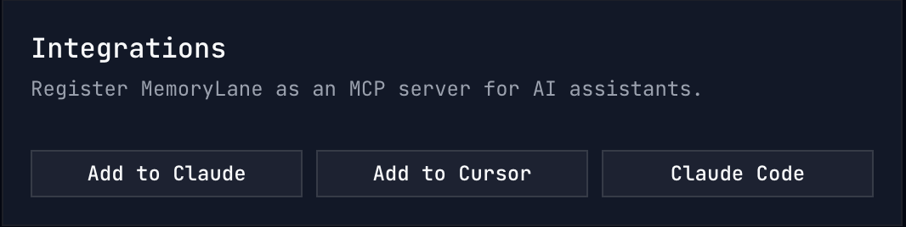

# MemoryLane — Installation

## 1. Install the plugin

Watch the [installation walkthrough](https://www.loom.com/share/f8bcc7db424746b99c0a93748dec3da6).

Install from the GitHub Marketplace:

```
deusxmachina-dev/memorylane
```

<details>
<summary><h2>2a. Analyzing your own data (MemoryLane desktop app installed)</h2></summary>

1. Go to **Integrations** and click **Add to Claude**.



2. Restart Claude Desktop.

</details>

<details>
<summary><h2>2b. Analyzing someone else's data (no desktop app)</h2></summary>

This is for users who want to analyze data from MemoryLane without the desktop app installed — for example, browsing someone else's shared data.

Watch the [MCP setup walkthrough](https://www.loom.com/share/b6330ba741654a87bc9875105c973daa).

1. Open the config file:

   | OS          | Path                                                              |
   | ----------- | ----------------------------------------------------------------- |
   | **macOS**   | `~/Library/Application Support/Claude/claude_desktop_config.json` |
   | **Windows** | `%APPDATA%\Claude\claude_desktop_config.json`                     |

2. Add `memorylane` inside the `mcpServers` object ([copy from our repo](https://github.com/deusXmachina-dev/memorylane/tree/main/plugins/memorylane)):

   ```json
   {
     "mcpServers": {
       "memorylane": {
         "command": "npx",
         "args": ["-y", "-p", "@deusxmachina-dev/memorylane-cli@latest", "memorylane-mcp"],
         "env": {}
       }
     }
   }
   ```

   If you already have other MCP servers, add the `"memorylane": { ... }` block alongside them.

3. Restart Claude Desktop.

To use a custom database path, set `MEMORYLANE_DB_PATH` in the config:

```json
"env": {
  "MEMORYLANE_DB_PATH": "/path/to/your/memorylane.db"
}
```

Or use the `set_db_path` tool after connecting.

</details>
